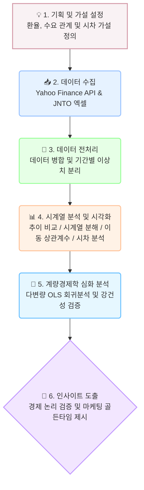

# ✈️ 원/엔 환율과 일본 여행객 수의 시계열 관계 분석
* **Data Source:** Yahoo Finance (환율 `JPYKRW=X`) / JNTO (일본정부관광국 방일 외래객 통계)
* **Analysis Period:** 2010년 1월 ~ 2024년 8월 (월별 시계열 데이터)

본 프로젝트는 장기화된 '엔저 현상'이 한국인의 일본 여행 수요에 미치는 통계적 영향을 검증하고, 나아가 대지진·팬데믹·외교 갈등과 같은 역사적 외부 충격(Black Swan)이 이러한 경제적 상관관계를 어떻게 붕괴시키는지 2010년부터의 데이터를 바탕으로 심층 분석했습니다.

---

## 💡 데이터 분석 수행 흐름도



---

## 🎯 프로젝트 미션

* 원/엔 환율 변동이 한국인의 일본 여행 수요에 미치는 실제 영향 입증
* 시계열 분해(Decomposition)를 통한 환율 외 고정적 수요(계절성) 검증
* 환율 하락 뉴스가 실제 여행 수요로 전환되기까지의 시차(Lag) 추정
* 2010년 이후 12개월 이동 상관계수(Rolling Correlation)를 추적하여 역사적 외부 충격이 경제 원리에 미치는 영향력 분석
* 다변량 회귀분석(OLS)을 통한 환율 시차 및 월별 계절성 복합 설명력 모델링

---

## 🛠 기술 스택 및 분석 기법

* **Environment:** Python 3.10+, Jupyter Notebook
* **Libraries:** `pandas`, `numpy`, `scipy`, `statsmodels`, `matplotlib`, `seaborn`, `yfinance`, `openpyxl`
* **주요 분석 기법 (파생 변수 및 모델):**
  * **3개월 이동평균(3MA):** 단기적인 환율 노이즈를 평활화(Smoothing)하여 중장기 거시 추세 도출
  * **방문객 변화율(ROC, %):** 전월 대비 증감 속도를 산출하여 외부 충격(Black Swan) 발생 시점의 타격 민감도 측정
  * **12개월 이동 상관계수(Rolling Correlation):** 시계열 동적 상관성을 추적하여 경제 공식 붕괴 시점 포착
  * **교차 상관 분석(Cross-Correlation):** 0~6개월 시차(Lag)별 상관계수 및 $p$-value 검증
  * **다변량 OLS 회귀 모델:** 환율 3개월 시차 및 12개 월 더미 변수를 결합한 수요 설명 모형 구축

---

## 🚀 주요 분석 요약

* **역의 상관관계 입증:** 환율 하락(엔저) 시 방문객이 급증하는 전반적인 트렌드와 우하향 산점도 확인 (분기별 리샘플링 집계 시에도 $r = -0.523$ 일관성 확인)
* **확고한 계절성 발견:** 환율 상황과 무관하게 매년 1~2월 겨울 성수기(온천/눈축제/방학)에 방문객이 압도적으로 몰리고, 9월(태풍/휴가 직후)이 최비수기인 고유 패턴 규명
* **3~4개월의 골든타임 (Lag Effect):** 교차 상관 분석 결과, 환율 하락 시점으로부터 3~4개월 뒤에 여행 수요가 가장 강력하게 반응함($r = -0.632$, $p = 2.03 \times 10^{-14}$)을 입증하여 항공/여행업계의 선행 마케팅 지표 제시
* **심층 분석 (블랙스완의 위력):** 이동 상관계수 분석 결과, 대지진(2011, 2016), 노재팬(2019), 코로나19(2020) 등 사회/자연적 충격이 발생한 6차례의 구간에서는 환율 하락 효과가 완전히 무효화되며 경제적 상관관계가 붕괴됨을 증명
* **[심화] 다변량 OLS 설명력 ($R^2 = 0.452$):** 환율 3개월 시차와 월별 계절성만으로 여행객 변동의 45.2%를 유의미하게 설명($p < 0.001$)하며, 1엔당 환율 1원 하락 시 3개월 뒤 방문객 약 6.8만 명 증가 추정치 도출

---

## 💻 실행 방법 (Getting Started)

### 1. 패키지 설치
```bash
pip install -r requirements.txt
```

### 2. 주피터 노트북 실행
```bash
jupyter notebook analysis.ipynb
```
전체 분석 코드는 `analysis.ipynb`에 마크다운 해설과 함께 단계별로 구성되어 있습니다.

---

## 📁 프로젝트 디렉토리 구조

```text
japan-travel-analysis/
├── analysis.ipynb          # 전체 시계열 분석 및 모델링 주피터 노트북
├── requirements.txt        # 프로젝트 실행 의존성 라이브러리 목록
├── README.md               # 프로젝트 요약 및 안내 문서
├── REPORT.md               # 종합 분석 리포트 (Fact-Why-Action 기반)
├── data/                   # 일본정부관광국(JNTO) 외래객 통계 원본 데이터
│   ├── tourists_to_japan.csv
│   └── tourists_to_japan.xlsx
└── images/                 # 분석 시각화 차트 이미지 (11종)
```
