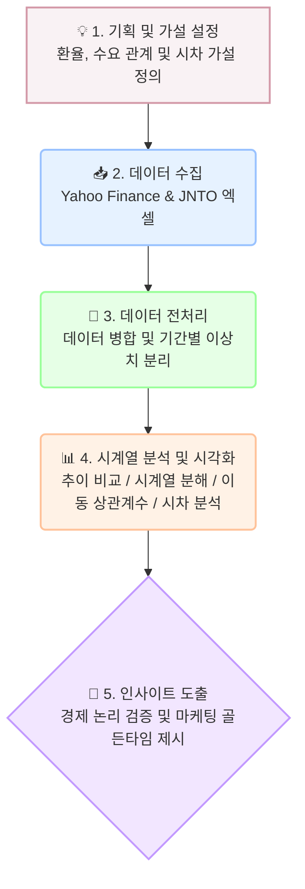

# ✈️ 원/엔 환율과 일본 여행객 수의 시계열 관계 분석
* **GitHub Repository URL:** [본인의 깃허브 저장소 주소 입력]
* **Data Source:** Yahoo Finance (환율) / JNTO (일본 방문객 통계)

본 프로젝트는 장기화된 '엔저 현상'이 한국인의 일본 여행 수요에 미치는 통계적 영향을 검증하고, 나아가 대지진·팬데믹·외교 갈등과 같은 역사적 외부 충격(Black Swan)이 이러한 경제적 상관관계를 어떻게 붕괴시키는지 2010년부터의 데이터를 바탕으로 심층 분석했습니다.

## 💡 데이터 분석 수행 흐름도



## 🎯 프로젝트 미션

* 원/엔 환율 변동이 한국인의 일본 여행 수요에 미치는 실제 영향 입증
* 시계열 분해(Decomposition)를 통한 환율 외 고정적 수요(계절성) 검증
* 환율 하락 뉴스가 실제 여행 수요로 전환되기까지의 시차(Lag) 추정
* 2010년 이후 12개월 이동 상관계수(Rolling Correlation)를 추적하여 역사적 외부 충격이 경제 원리에 미치는 영향력 분석

## 🛠 기술 스택 및 구조

* **Language:** Python (Pandas, Matplotlib, Seaborn, Statsmodels)
* **주요 분석 기법 (파생 변수):**
  * **이동평균(Moving Average):** 단기적인 환율의 노이즈를 제거하고 중장기적인 추세를 부드럽게 파악하기 위해 3개월(분기) 이동평균을 적용함.
  * **변화율(Rate of Change):** 전월 대비 방문객의 증감 속도를 백분율(%)로 산출하여, 특정 이벤트 발생 시점의 타격 민감도를 분석할 목적으로 활용함.

## 🚀 주요 분석 요약

* **역의 상관관계 입증:** 환율 하락(엔저) 시 방문객이 급증하는 전반적인 트렌드와 우하향 산점도 확인
* **확고한 계절성 발견:** 환율 상황과 무관하게 매년 1~2월 겨울 성수기에 방문객이 압도적으로 몰리는 고유 패턴 규명
* **3~4개월의 골든타임 (Lag Effect):** 교차 상관 분석 결과, 환율 하락 시점으로부터 3~4개월 뒤에 여행 수요가 가장 강력하게 반응함을 입증하여 항공/여행업계의 선행 마케팅 지표 제시
* **심층 분석 (블랙스완의 위력):** 이동 상관계수 분석 결과, 대지진(2011, 2016), 노재팬(2019), 코로나19(2020) 등 사회/자연적 충격이 발생한 6차례의 구간에서는 환율 하락 효과가 완전히 무효화되며 경제적 상관관계가 붕괴됨을 증명

```
