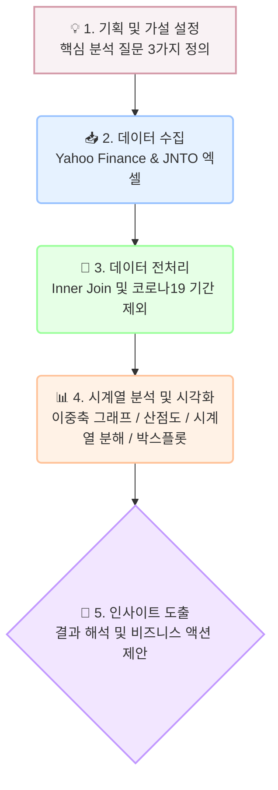

# ✈️ 일본 여행객과 원/엔 환율 시계열 분석

본 프로젝트는 최근 장기화되고 있는 역대급 '엔저 현상'이 실제 한국인의 일본 여행 수요에 어떤 통계적 영향을 미치는지 데이터로 검증하기 위해 진행되었습니다. 단순한 추세 확인을 넘어 이상치 처리와 시계열 분해를 통해 심층적인 인사이트를 도출하는 것을 목표로 합니다.


## 💡 데이터 분석 수행 흐름도



## 🎯 프로젝트 미션

* 원/엔 환율 변동이 한국인의 일본 여행 수요에 미치는 실제 영향 분석
* 코로나19 기간(2020.03~2022.09)을 이상치로 분리하여 데이터 왜곡 방지
* 시계열 분해(Decomposition)를 통한 고정적인 수요(계절성) 검증

## 🛠 기술 스택 및 구조

* **Language:** Python (Pandas, Matplotlib, Seaborn, Statsmodels)
* `analysis.ipynb`: 전처리 및 시각화 코드가 포함된 메인 실행 노트북
* `REPORT.md`: 핵심 인사이트와 비즈니스 액션이 정리된 상세 분석 리포트
* `data/` & `images/`: 원본 데이터(Yahoo Finance, JNTO) 및 시각화 결과 이미지 폴더

## 🚀 주요 분석 요약

* **역의 상관관계:** 환율 하락(엔저) 시 방문객이 폭발적으로 급증하는 뚜렷한 이중 축 트렌드 확인
* **통계적 검증:** 산점도와 추세선을 통해 코로나 기간을 제외한 두 지표 간의 우하향 관계 입증
* **계절성 발견:** 시계열 분해와 박스플롯 분석 결과, 1~2월 겨울 성수기에 방문객이 압도적으로 몰리는 고유 패턴 확인

```
