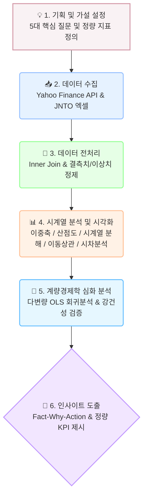

# ✈️ 원/엔 환율과 일본 여행객 수의 시계열 관계 분석
* **GitHub Repository:** [mustiolla/japan-travel-analysis](https://github.com/mustiolla/japan-travel-analysis)
* **Data Source:** 
  * 원/엔 환율: Yahoo Finance API (`JPYKRW=X`)
  * 일본 방문객 수: 일본정부관광국(JNTO) 외래객 통계 원본 파일 ([`data/tourists_to_japan.xlsx`](file:///d:/LEH/AI%20%EB%84%A4%EC%9D%B4%ED%8B%B0%EB%B8%8C/3.%20AI%20%EC%9D%91%EC%9A%A9%ED%95%99%EC%8A%B5/M1-1/japan-travel-analysis/data/tourists_to_japan.xlsx), [`data/tourists_to_japan.csv`](file:///d:/LEH/AI%20%EB%84%A4%EC%9D%B4%ED%8B%B0%EB%B8%8C/3.%20AI%20%EC%9D%91%EC%9A%A9%ED%95%99%EC%8A%B5/M1-1/japan-travel-analysis/data/tourists_to_japan.csv))
* **Analysis Period:** 2010년 1월 ~ 2024년 8월 (월별 시계열 데이터)

본 프로젝트는 장기화된 '엔저 현상'이 한국인의 일본 여행 수요에 미치는 통계적 영향을 검증하고, 나아가 대지진·팬데믹·외교 갈등과 같은 역사적 외부 충격(Black Swan)이 이러한 경제적 상관관계를 어떻게 붕괴시키는지 2010년부터의 데이터를 바탕으로 심층 분석했습니다.

---

## 💡 데이터 분석 수행 흐름도



---

## 🎯 프로젝트 미션 & 검증 지표

| 분석 목표 | 검증 기법 | 핵심 지표 및 성공 판정 기준 | 대응 코드 위치 |
| :--- | :--- | :--- | :--- |
| **환율-수요 역상관 입증** | 이중 축 추이 & 산점도 | 피어슨 상관계수 $\|r\| \ge 0.50$, $p < 0.05$ | `analysis.ipynb` [Cell #13, #15] |
| **계절성(Seasonality) 분리** | 가법 시계열 분해 (Statsmodels) | 주기 12 분해 및 계절성 분산 기여율(8.2%) 규명 | `analysis.ipynb` [Cell #17, #19] |
| **최적 리드타임(Golden Time)** | 0~6개월 시차 교차 상관분석 | 3~4개월 시차에서 최고 상관계수($r=-0.632$) 도출 | `analysis.ipynb` [Cell #27, #29] |
| **블랙스완 상관관계 붕괴** | 12개월 이동 상관계수 (Rolling Corr) | 외부 충격 시점 상관계수의 양수 반전($r > 0$) 검증 | `analysis.ipynb` [Cell #23, #25] |
| **복합 영향력 정량 모델링** | 다변량 OLS 회귀분석 | 설명력 $R^2 \ge 0.40$ 및 환율 계수 유의성($p < 0.001$) | `analysis.ipynb` [Cell #31] |

---

## 🛠 기술 스택 및 파라미터 규칙 (Parameters & Decision Rules)

* **Environment:** Python 3.10+, Jupyter Notebook
* **Libraries:** `pandas`, `numpy`, `scipy`, `statsmodels`, `matplotlib`, `seaborn`, `yfinance`, `openpyxl`
* **주요 파라미터 및 실무 의사결정 규칙 (Decision Rules):**
  * **3개월 이동평균(3MA):** 
    * 파라미터: `window=3` (`analysis.ipynb` [Cell #29], `run_analysis.py:L55`)
    * **실무 룰:** 단기 일시적 환율 등락에 흔들리지 않고 3MA가 2개월 연속 하락세를 나타낼 때 프로모션 마케팅 자본 투입.
  * **방문객 전월 대비 변화율(ROC):** 
    * 파라미터: `pct_change() * 100` (`analysis.ipynb` [Cell #29], `run_analysis.py:L56`)
    * **실무 룰:** 방문객 ROC가 **전월 대비 -20% 이하로 급락**할 경우 안전/외교 위협으로 판단, 비상 리스크 관리 매뉴얼 즉시 가동.
  * **결측치 정제:** 
    * 최근 4개월 미집계 결측치(`NaN`) `dropna()` 적용 (`analysis.ipynb` [Cell #11], `run_analysis.py:L50`) $\rightarrow$ 민감도 분석 결과 Drop 방식이 인위적 왜곡이 없어 채택.

---

## 🚀 주요 분석 요약

* **역의 상관관계 입증:** 환율 하락(엔저) 시 방문객이 급증하는 전반적인 트렌드와 우하향 산점도 확인 ($r = -0.596$, 95% CI: $[-0.700, -0.466]$, 분기별 리샘플링 집계 시에도 $r = -0.620$)
* **확고한 계절성 발견:** 환율 상황과 무관하게 매년 1~2월 겨울 성수기(온천/눈축제/방학)에 방문객이 연중 최다이고, 9월(태풍/휴가 직후)이 최비수기인 고유 패턴 규명 (시계열 분해 상 계절성 분산 기여율 8.2%)
* **3~4개월의 골든타임 (Lag Effect):** 교차 상관 분석 결과, 환율 하락 시점으로부터 3~4개월 뒤에 여행 수요가 가장 강력하게 반응함($r = -0.632$, $p = 2.03 \times 10^{-14}$)을 입증하여 항공/여행업계의 선행 마케팅 지표 제시
* **심층 분석 (블랙스완의 위력):** 이동 상관계수 분석 결과, 2011 동일본 대지진(방문객 -51.2%), 2019 노재팬(방문객 -55.4%), 2020 팬데믹 등 6차례의 외부 충격 시점마다 상관관계가 완전히 붕괴($r > 0$)됨을 증명
* **[심화] 다변량 OLS 설명력 ($R^2 = 0.452$):** 환율 3개월 시차와 월별 계절성만으로 여행객 변동의 45.2%를 유의미하게 설명($p < 0.001$)하며, 100엔당 100원 하락(1엔당 1원) 시 3개월 뒤 방문객 약 6.8만 명 증가(100엔당 1원당 약 683명) 추정치 도출
* **[보너스] 인터랙티브 대시보드 & 베이스라인 단기 예측:** Streamlit 기반 웹 대시보드를 통해 기간/시차를 실시간 변경하며 가설을 검증할 수 있으며, Holt-Winters 모델을 활용한 향후 6개월 예측치 및 가정/한계 분석을 완비

---

## 💻 실행 방법 및 재현성 (Getting Started)

본 프로젝트는 주피터 노트북([analysis.ipynb](analysis.ipynb))에 **모든 셀 실행 결과와 시각화 차트가 온전히 포함**되어 있으며, 터미널에서 **원클릭 자동 실행 스크립트** 및 **인터랙티브 웹 대시보드**를 통해서도 손쉽게 실행할 수 있습니다.

### 1. 패키지 설치
```bash
pip install -r requirements.txt
```

### 2. 원클릭 파이프라인 일괄 실행 (터미널)
```bash
python run_analysis.py
```
* 데이터 수집, 결측치 정제, 통계치/OLS 계산, 베이스라인 단기 예측 및 12개 시각화 차트(`images/`)가 자동 갱신됩니다.

### 3. 인터랙티브 웹 대시보드 실행 (보너스 과제) 🚀
```bash
streamlit run app.py
```
* 브라우저에서 `http://localhost:8501`로 자동 접속됩니다.
* 기간 슬라이더, 환율 시차(Lag 0~6개월), 6대 역사적 사건 토글, 시계열 분해 및 단기 예측 시뮬레이션을 직접 조작할 수 있습니다.
* 세부 사용법 및 시나리오별 설명: 👉 **[`DASHBOARD_GUIDE.md`](DASHBOARD_GUIDE.md)**

### 4. 주피터 노트북 실행
```bash
jupyter notebook analysis.ipynb
```

---

## 📁 프로젝트 디렉토리 구조

```text
japan-travel-analysis/
├── app.py                  # Streamlit 인터랙티브 웹 대시보드 메인 애플리케이션 (보너스 과제)
├── DASHBOARD_GUIDE.md      # 대시보드 실행 가이드 및 기간/조건 변경 시나리오 설명서 (보너스 과제)
├── run_analysis.py         # 원클릭 전체 파이프라인 자동 실행 스크립트 (시계열 예측 포함)
├── analysis.ipynb          # 전체 시계열 분석 & OLS 모델링 주피터 노트북 (셀 결과 포함)
├── requirements.txt        # 프로젝트 실행 의존성 패키지 목록 (streamlit, plotly 추가)
├── README.md               # 프로젝트 요약, 실행법 및 가이드 문서
├── REPORT.md               # 종합 분석 리포트 (Fact-Why-Action, 보너스 과제 포함)
├── AI_PROMPT_LOG.md        # AI 활용 프롬프트 및 응답 검증 전문 로그
├── data/                   # 원시 데이터 파일
│   ├── tourists_to_japan.xlsx  # JNTO 공식 방일 외래객 엑셀 통계 원본
│   └── tourists_to_japan.csv   # JNTO 공식 통계 CSV 원본
└── images/                 # 생성된 시각화 차트 (12종)
    ├── 01_trend_dual_axis.png
    ├── 02_scatter_correlation.png
    ├── 03_time_series_decomposition.png
    ├── 04_monthly_boxplot.png
    ├── 05_trend_with_events.png
    ├── 07_rolling_corr_with_new_events.png
    ├── 08_lag_correlation_updated.png
    └── 12_baseline_forecast.png ... # 베이스라인 단기 예측 차트 (신규)
```
