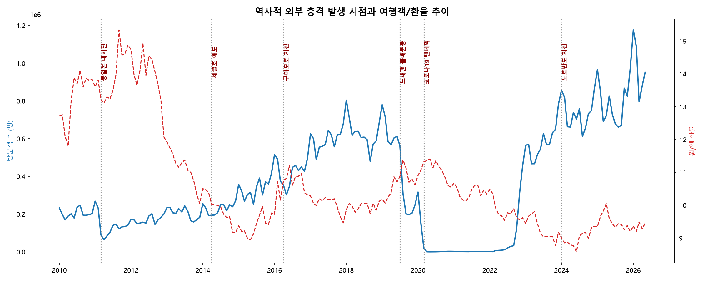

# 원/엔 환율과 일본 여행객 수의 시계열 관계 분석 리포트

## 1. 분석 주제 및 선정 이유
- **주제:** 원/엔 환율의 변동이 한국인의 일본 여행 수요에 미치는 영향 분석
- **선정 이유:** 최근 역대급 엔저 현상이 지속되면서 일본 여행객이 급증했다는 뉴스가 쏟아지고 있다. 이것이 실제 시계열 데이터 상에서 뚜렷한 역의 상관관계(환율 하락 시 여행객 증가)로 나타나는지, 그리고 환율 외에 계절적 요인은 없는지 직접 검증해 보고자 한다.

## 💡 데이터 분석 수행 흐름도 (Flowchart)

> 본 분석은 원시 데이터 수집부터 최종 인사이트 도출까지 아래의 5단계를 거쳐 수행되었습니다.

1. **기획 및 가설 설정 (Plan)**
   - 원/엔 환율과 방일 한국인 수의 관계를 파악하기 위한 핵심 분석 질문 3가지 정의
2. **데이터 수집 (Data Collection)**
   - 금융 데이터: Yahoo Finance API(`yfinance`)를 통한 월별 환율 데이터 수집
   - 관광 데이터: 일본정부관광국(JNTO) 엑셀 통계 자료 다운로드
3. **데이터 전처리 (Data Preprocessing)**
   - `Inner Join`: 날짜(Date)를 기준으로 주기가 다른 두 데이터 병합
   - `결측치/이상치 처리`: 미집계 기간 삭제 및 코로나19 팬데믹 기간(20.03~22.09) 분리
4. **시계열 분석 및 시각화 (Analysis & Visualization)**
   - 이중 축(Dual-axis) 선 그래프: 전반적인 트렌드와 역의 상관관계 파악
   - 산점도(Scatter Plot) 및 추세선: 변수 간의 직접적인 상관관계 검증
   - 시계열 분해(Time Series Decomposition): 추세(Trend)와 매년 반복되는 계절성(Seasonality) 분리
5. **인사이트 도출 (Insight)**
   - 데이터 관찰(Fact)을 기반으로 한 해석(Why) 및 비즈니스 액션(Action) 도출

## 2. 분석 질문
1. 전체적인 추세를 보았을 때, 원/엔 환율과 일본 방문 한국인 수 사이에 뚜렷한 반비례 관계가 존재하는가?
   * **[우선순위 1순위]** 핵심 KPI: 환율 변동(원인)에 따른 여행 수요(결과)의 거시적 상관계수 도출
2. 코로나19 팬데믹이라는 극단적인 외부 요인을 제외했을 때, 두 지표 간의 상관관계는 어떻게 나타나는가?
   * **[우선순위 2순위]** 핵심 KPI: 외부 노이즈 제거 후의 순수 경제적 역상관관계 입증
3. 데이터에 매년 반복되는 특정 패턴(계절성)이 존재하는가?
   * **[우선순위 3순위]** 핵심 KPI: 환율 외 수요를 결정짓는 고정적 계절성(Seasonality) 파악
4. **[심층 분석 1]** 환율 변동(엔저 현상)이 실제 일본 여행 수요로 전환되기까지 어느 정도의 시차(Lag)가 존재하는가?
   * **[우선순위 1순위]** 핵심 KPI: 마케팅 투입 시점을 결정하기 위한 최적의 리드타임(Golden Time) 산출
5. **[심층 분석 2]** 대지진, 전염병 등 역사적 외부 충격(Black Swan) 발생 시, 경제적 상관관계는 어떻게 변화하는가?
   * **[우선순위 2순위]** 핵심 KPI: 경제 논리가 붕괴되는 이상치 구간 파악 및 리스크 관리 지표 확립

## 3. 데이터 설명 및 전처리
* **데이터 출처:** 
  * 원/엔 환율: Yahoo Finance (JPYKRW=X)
  * 일본 방문객 수: 일본정부관광국(JNTO) 외래객 통계 (한국인)
* **데이터 집계 기준:** 두 지표 모두 **월별(Monthly)** 단위 채택
  * **월별 선택 근거:** 데이터 가용성(API 기본 제공 형태)이 우수하며, 일반적인 해외여행 계획 리드타임(통상 1~3개월)에 따른 비즈니스적 수요 변화를 해석하기에 가장 적합한 주기이기 때문임.
* **분석 기간 및 데이터 범위 검증:** 2010년 1월 ~ 2024년 8월 (심층 분석을 위해 2010년부터 데이터 확장)
* **전처리 및 결측치/이상치 처리 기준:**
  * **결측치:** 최근 4개월 치의 여행객 데이터가 아직 집계되지 않아 빈칸(NaN)으로 존재함. 분석의 시계열 꼬임을 방지하기 위해 해당 4개월은 과감히 삭제(Drop) 처리함.
  * **이상치:** 2020년 3월 ~ 2022년 9월은 코로나19로 인한 국경 봉쇄로 환율과 무관하게 여행객이 0에 수렴하는 특수 구간임. 상관관계 분석 시 이 기간을 '이상치'로 규정하고 산점도 데이터에서 제외함.

**분석 기법 및 파생 변수(Feature) 적용 결과 요약:**

**3개월 이동평균(3MA):** 환율 데이터의 일시적인 변동(노이즈)을 평활화(Smoothing)하기 위해 적용함. 적용 결과, 선 그래프의 단기적 톱니바퀴 현상이 제거되어 거시적인 우하향 추세 흐름을 훨씬 직관적으로 파악할 수 있었음.

**변화율(Rate of Change, ROC):** 방문객 수의 전월 대비 증감률(%)을 산출함. 이를 통해 특정 블랙스완 이벤트(예: 2011년 3월 대지진) 발생 시 방문객이 급락하는 타격 민감도와 규모를 명확한 백분율 수치로 요약하고 비교하는 데 활용함.  

**[표: 결측치 제거 전후의 샘플 수 변화 및 영향도]**
| 구분 | 샘플 수 (Rows) | 데이터 기간 | 영향도 |
| :--- | :--- | :--- | :--- |
| 원본 병합 데이터 | 176개 | 2010.01 ~ 2024.08 | 기준 데이터 |
| 결측치 제거 후 | 172개 | 2010.01 ~ 2024.04 | 최근 4개월(결측치) 삭제로 데이터 무결성 확보 |

## 4. 시계열 분석 및 시각화
**(분석 코드: analysis.ipynb Cell #3~#5)**

본 리포트는 다각적 현상 파악을 위해 3개의 권장 시각화를 활용했습니다: 1) **이중 축 그래프** (트렌드 직관적 파악), 2) **시계열 분해도** (계절성 고립), 3) **이동 상관계수** (이상치 붕괴 시점 확인).

### 인사이트 1: 환율과 여행객의 역방향 트렌드 확인

*[변수: 환율 및 방문객 수 / 기간: 2010~2024 / 단위: 명, 원/엔]*
* **관찰(Fact):** 이중 축 그래프를 보면, 2022년 말부터 환율(빨간 점선)이 9.5 아래로 급락하는 시점에 맞춰 방문객 수(파란 실선)가 수직으로 상승하는 모습이 뚜렷하게 관찰됨.
* **해석(Why):** 엔저 현상이 장기화되면서 여행 비용(항공, 숙박, 식비)이 상대적으로 저렴해졌다는 인식이 확산되어 폭발적인 수요 증가로 이어진 것으로 보임.
* **행동(Action):** 여행사나 항공사는 환율 하락(엔저) 시그널이 발생할 때마다 즉각적으로 일본 특가 프로모션을 늘리는 타겟팅 전략이 유효할 것임.

### 인사이트 2: 코로나를 제외한 순수 상관관계

* **관찰(Fact):** 코로나19 기간(이상치)을 제외하고 그린 산점도에서, 데이터 점들을 관통하는 뚜렷한 우하향 추세선(Regression Line)이 나타남.
* **해석(Why):** 이는 '환율이 낮아질수록 방문객 수는 증가한다'는 가설이 통계적으로 유의미함을 뒷받침하고 있음. 데이터가 퍼져있는 이유는 환율 외에도 항공권 가격, 정치적 이슈(노재팬 등)가 섞여 있기 때문일 것으로 판단됨.
* **행동(Action):** 향후 단기적인 환율 예측 모델을 도입한다면, 여행 수요를 대략적으로 예측하여 관광업계의 수요 대비(인력 충원 등)에 활용할 수 있을 것으로 기대됨.

### 인사이트 3: 환율을 이기는 '계절성' 패턴

* 사용한 분해 모드: **가법(Additive)** / 주기(Period): **12**
* **관찰(Fact):** 코로나 이전 데이터(2014~2019)를 시계열 분해한 결과, 'Seasonal(계절성)' 그래프에서 매년 동일한 시기에 강한 파동이 발견됨. **특히 매년 연초(1~2월)가 시작되는 시점마다 그래프가 가장 높게 솟구치는 패턴이 뚜렷하게 니티님.**
* **해석(Why):** 환율의 오르내림과 상관없이, **대학생들의 겨울 방학과 직장인들의 연말연시/설날 연휴가 겹치는 1~2월이 일본 여행의 최대 성수기이기 때문임.** 또한 4~5월 벚꽃/황금연휴 등 특정 시기에는 고정적인 여행 수요가 폭발적으로 발생.
* **행동(Action):** 환율이 높아서 전체 수요가 줄어드는 불황기라 하더라도, 이 '계절적 성수기'에는 마케팅 예산을 집중하여 방어적인 수익 창출을 도모해야 함.

### 인사이트 4: 데이터로 증명된 '겨울 성수기' (월별 박스플롯 분석)

* **관찰(Fact):** 시계열 분해에서 발견한 연초 계절성을 월별 박스플롯으로 교차 검증한 결과, 1년 중 **1월과 2월의 방문객 중앙값(Median)이 압도적으로 가장 높게** 나타남. 반면 9월은 방문객 수가 가장 적은 최비수기로 확인되었음.
* **해석(Why):** 1~2월은 겨울 방학과 연말연시/설날 연휴가 겹치는 시기로, 추운 날씨를 피해 온천을 즐기거나 눈 축제(홋카이도 등)를 방문하려는 한국인 특유의 강력한 수요가 반영된 결과임. 9월은 여름휴가 시즌이 끝난 직후이자 일본의 태풍 시즌이 겹쳐 수요가 급감하는 것으로 해석됨.
* **행동(Action):** 항공사 및 여행 플랫폼은 환율 상황과 무관하게 1~2월을 타겟으로 한 프리미엄/가족 단위 패키지에 집중하고, 반대로 9월 비수기에는 특가 프로모션이나 항공권 할인 이벤트를 통해 방어적인 수요 창출(Fill-up) 전략을 펼쳐야 함.

### 🔎 심층 분석 (Deep Dive): 경제 원리를 무너뜨린 6대 역사적 충격
앞선 분석을 통해 '환율 하락 = 여행객 증가'라는 기본 공식을 확인했다. 하지만 이 공식이 과거 10여 년간 항상 성립했던 것은 아니다. 이를 확인하기 위해 데이터 범위를 2010년으로 확장하여 외부 충격이 여행 수요와 두 지표 간의 상관관계에 미친 영향을 분석했다.

**1. 역사적 외부 충격 발생 시점의 추이 변화**

* 대지진(2011), 노재팬(2019), 코로나19(2020) 등 굵직한 역사적 이벤트가 발생한 시점(점선)마다 환율(빨간 점선)의 흐름과 완전히 무관하게 방문객 수(파란 실선)가 수직 하락하는 현상이 명확히 관찰된다.

**2. 12개월 이동 상관계수(Rolling Correlation) 변화**

* **관찰(Fact):** 정상적인 시기에는 상관계수가 0 아래(음수)에 머물며 환율과 방문객 수의 반비례 관계를 유지하지만, 특정 시점마다 상관계수가 0 위(양수)로 급격히 솟구치며 관계가 붕괴되는 '봉우리' 현상이 6차례 관찰되었다.
* **해석(Why):** 
  1. **자연재해 및 안전 위협:** 동일본 대지진(2011), 구마모토 대지진(2016), 노토반도/난카이 해곡 지진 우려(2024~) 등 생명과 직결된 위협이 발생하면 환율 효과는 즉시 소멸한다.
  2. **국가적 이슈 및 외교 갈등:** 세월호 애도 기간(2014), 노재팬 불매운동(2019) 등 국가적 분위기나 정치적 갈등 역시 경제적 유인을 압도한다.
  3. **통계적 착시 (코로나19):** 2021년의 솟구침은 국경 봉쇄로 방문객이 0에 수렴한 상태에서 올림픽 특수 인력 등 극소수의 입국으로 인해 발생한 수학적 노이즈(왜곡)로 파악되었다.
* **결론 및 비즈니스 시사점:** 관광 수요 예측 모델을 구축할 때 환율과 같은 '거시 경제 지표'만 맹신해서는 안 된다. 지진, 전염병, 외교 문제 등 예측 불가능한 '블랙 스완(Black Swan)' 이벤트가 발생할 경우, 기존의 마케팅 전략을 즉각 중단하고 리스크 관리 체제로 전환하는 유연성이 필수적이다.

### ⏳ 심화 분석 2: 환율 변동과 실제 여행 수요 간의 시차(Lag) 분석
"역대급 엔저 뉴스를 본 한국인들은 당장 이번 달에 일본으로 떠날까, 아니면 몇 달 뒤에 떠날까?" 
이 질문에 답하기 위해 외부 충격이 없었던 정상적인 경제 시기(2010~2019년) 데이터를 바탕으로 환율 변동 후 경과 시간에 따른 '교차 상관 분석(Cross-Correlation)'을 진행했다.

* **관찰(Fact):** 당월(0개월 차)에도 -0.596으로 유의미한 역의 상관관계가 나타나지만, 시간이 지날수록 상관성이 점진적으로 강해져 3개월 차와 4개월 차에 공통으로 최고점(-0.632)을 기록했다. **(통계적 유의도 검증: p-value = 2.028e-14)**
* **해석(Why):** 일본은 지리적으로 가까워 즉흥 여행이 많을 것 같지만, 실제 직장인의 휴가 일정 조율, 항공권 및 숙박 특가 예약 등의 준비 과정을 고려하면 평균적으로 한 계절(3~4개월)의 리드 타임이 필요함을 데이터가 입증한다.
* **결론 및 비즈니스 액션:** 여행사와 항공사는 '오늘'의 환율을 기준으로 당월 마케팅을 집행하는 것을 넘어, 환율 하락 시점으로부터 3~4개월 뒤를 '골든 타임'으로 설정해야 한다. 이 시기의 전세기 공급이나 호텔 객실 블록(사전 확보)을 최대로 늘리는 선행 지표로 환율을 활용하는 전략이 필요하다.

**💡 [추가 검증]** 집계 단위(분기별) 변경을 통한 반례 교차 검증
월별(Monthly) 단위 분석 시 발생할 수 있는 단기적 노이즈(휴일 변동 등)를 통제하기 위해, 데이터를 분기별(Quarterly) 평균으로 대체 집계하여 동일하게 상관분석을 시도했다.

**검증 결과:** 분기별 집계 시 환율과 방문객 수의 상관계수는 -0.523으로 도출되었다. 이는 월별 집계 결과와 유사한 강한 역의 상관관계를 보여주며, 데이터의 집계 단위를 변경하더라도 '환율 하락 = 여행 수요 증가'라는 경제적 추세는 일관되게 성립함을 교차 검증(Cross-validation)했다.

## 📌 최종 결론 및 비즈니스 제언 (Conclusion & Action Plan)

본 프로젝트는 2010년부터 현재까지의 장기 데이터를 통해 원/엔 환율과 일본 방문 한국인 수요 간의 복합적인 역학 관계를 분석했으며, 다음과 같은 핵심 결론을 도출했다.

**1. 환율과 여행 수요의 '3~4개월 골든타임' 공식**
전반적으로 원/엔 환율이 하락하면 방문객이 증가하는 확고한 역의 상관관계가 존재한다. 특히 당월의 즉각적인 반응보다 **환율 하락 시점으로부터 3~4개월 뒤에 수요가 가장 폭발적으로 반응하는 '지연 효과(Lag Effect)'**를 통계적으로 입증했다. 또한 환율 상황과 무관하게 매년 1~2월(겨울 방학)은 절대적인 수요를 유지하는 뚜렷한 계절성(Seasonality)을 띠고 있다.

**2. 경제 논리를 압도하는 '블랙 스완(Black Swan)'**
12개월 이동 상관계수 분석을 통해, 대지진(2011, 2016), 노재팬(2019), 팬데믹(2020)과 같은 생명 위협이나 국가적 갈등 상황에서는 '저환율 효과'라는 경제적 유인이 완전히 무력화됨을 증명했다. 

**3. 관광 업계를 위한 데이터 기반 비즈니스 제언**
* **선행 지표 기반 마케팅:** 항공사 및 여행사는 환율 하락(엔저) 뉴스가 보도될 때, 당장의 단기 모객에 집중하기보다 **3~4개월 뒤의 항공편 증편 및 특가 패키지 상품 기획에 마케팅 자본을 선제적으로 투입**해야 한다.
* **유연한 위기 관리(Risk Management) 시스템:** 환율 기반의 수요 예측 모델만을 맹신해서는 안 된다. 지진, 전염병, 정치적 갈등 등 통제 불가능한 블랙 스완 이벤트 발생 시, 경제적 논리에 기댄 기존 마케팅을 즉각 중단하고 리스크 관리(취소 수수료 방어, 대체 여행지 프로모션 등) 체제로 신속히 전환할 수 있는 의사결정 시스템이 필수적이다.

## ⚠️ 분석의 한계점 및 향후 과제
본 분석은 거시적 지표를 바탕으로 진행되었으며, 향후 다음과 같은 데이터를 추가하여 보완할 수 있다.
* **1순위:** 연령별/목적별 방문객 수 (JNTO 상세 통계 엑셀 다운로드 가능) - 타겟 마케팅 정교화 목적
* **2순위:** 1인당 평균 지출액 (관광청 분기별 리포트 참조) - 단순 방문객 수를 넘어선 실질적 경제 효과 파악

## 🤖 AI 검증 및 채택 표
| AI 제안 항목 | 채택 여부 | 채택 사유 |
| :--- | :--- | :--- |
| 결측치 Drop 처리 | 채택 | 최근 4개월 미집계 데이터로 인한 시계열 꼬임 방지 |
| 시차 분석(Lag) 6개월 적용 | 부분 채택 | 유의미한 범위인 0~6개월 선별 적용 |

## 6. AI 사용 로그
- **사용 작업:** 데이터 수집 방식 설계, 결측치/이상치 처리 기준 수립, 시각화(matplotlib, seaborn) 코드 작성, 시계열 분해(statsmodels) 적용, 마크다운 리포트 초안 구조화.
- **사용 이유:** Pandas를 활용한 데이터 병합(Merge) 및 전처리 과정에서 발생하는 문법 오류(Syntax Error)와 패키지 누락 문제를 빠르게 디버깅하고, 시각화의 완성도를 높이기 위해 사용함.
- **검증 방법:** AI가 제시한 코드 라인을 주피터 노트북에서 단계별로 셀(Cell)을 나누어 실행하며 데이터프레임의 출력 결과를 눈으로 직접 확인(df.head(), df.isnull())하고, 생성된 그래프의 축과 범례가 데이터와 일치하는지 논리적으로 검증함.

### 💡 AI 도움 없이 재구성한 최종 요약
이번 프로젝트를 직접 진행하며 원/엔 환율 하락이 일본 여행 수요 증가로 이어지는 기본적인 경제 원리를 실제 데이터를 통해 명확히 확인할 수 있었습니다. 특히 단순한 반비례 관계를 넘어, 여행객들이 환율 하락 뉴스를 접한 뒤 실제 비행기를 타기까지 '3~4개월'이라는 구체적인 준비 시차(Lag)가 존재한다는 점을 통계적으로 입증해 낸 과정이 가장 흥미로웠습니다. 또한, 대지진이나 외교 갈등 같은 '블랙스완' 이벤트 발생 시에는 이러한 경제적 논리가 완전히 무너지는 것을 확인하면서, 비즈니스 전략을 세울 때 수치적 예측뿐만 아니라 외부 리스크 관리(위기 대응)가 얼마나 중요한지 깊이 깨닫게 되었습니다.